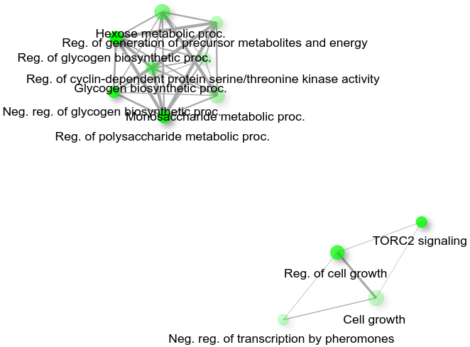

```{r setup, include=FALSE}
knitr::opts_chunk$set(echo = TRUE)
```

```{r warning=FALSE, error=FALSE, echo=F, show=F, include=F}
library(igraph)
library(tidyr)
library(dplyr)
library(ggraph)
library(tidygraph)

myblue <- "#4b89bf" #"#5d95c6"
```


## Introduzione

Le reti di interazione proteina-proteina (protein-protein interaction networks, o PPINs) rappresentano attraverso dei grafi i contatti fisici tra proteine in una cellula. Una PPIN può essere modellata da un grafo indiretto nel quale i nodi rappresentano le proteine e gli archi le interazioni. Sono utilizzate per:

* differenziare la fisiologia cellulare tra stati normali e stati di malattia
* raffinare i passaggi di pathway (vie) metabolici
* riconoscere il ruolo di proteine non caratterizzate

Bisogna tenere conto che, date le limitazioni delle tecniche di rilevamento di interazioni proteina-proteina, i dataset disponibili sono incompleti e "rumorosi".


## Dataset
Il [dataset](http://yfgdb.princeton.edu/cgi-bin/display.cgi?id=10688190&db=pmid) ([Uetz p., *et al.* (2000)](https://www.nature.com/articles/35001009)) si riferisce all'insieme proteine e interazioni tra esse all'interno di cellule di *S. cerevisiae*, o lievito di birra. È composto da 927 nodi (proteine) e 875 archi (interazioni).

* È vero che le PPINs posseggono le proprietà tipiche delle reti "reali" (componente gigante, effetto *small world*, distribuzione dei gradi a coda lunga)?
* Qual è il significato biologico di tali proprietà? 
* Si possono apprezzare altre caratteristiche?


## Import del dataset

```{r, echo=FALSE}
# load dataset
file <- "http://yfgdb.princeton.edu/DBXREF/yfgdb/10688190id650/biogrid10688190id650.tab.txt"
yeast_interactome <- read.csv(file = file, 
                              header = FALSE,
                              sep = "\t",
                              col.names = c("INTERACTOR_A", "INTERACTOR_B", "OFFICIAL_SYMBOL_FOR_A", "OFFICIAL_SYMBOL_FOR_B", "ALIASES_FOR_A", "ALIASES_FOR_B", "EXPERIMENTAL_SYSTEM", "SOURCE", "PUBMED_ID", "ORGANISM_A_ID", "ORGANISM_B_ID"))
head(yeast_interactome)
```

```{r, echo=FALSE}
yeast_node_interactions <- yeast_interactome %>%
  select(INTERACTOR_A, INTERACTOR_B)
# summary(yeast_node_interactions)
```

```{r, echo=FALSE, fig.height = 10, fig.width = 14, fig.align = "center"}
yeast_graph <- as_tbl_graph(yeast_node_interactions, 
                            directed = FALSE)
# yeast_graph

# plot graph
set_graph_style(family = "sans")
ggraph(yeast_graph, 
       layout = "stress",
       # layout = "igraph",
       # algorithm = "nicely"
       ) +
  geom_edge_link(colour = "gray") +
  geom_node_point(colour = "black",
                  fill = myblue,
                  shape = 21,
                  size = 2)
```


## Componente gigante

```{r, echo=FALSE}
# select biggest component
components <- clusters(yeast_graph, 
                       mode = "weak")
biggest_cluster_id <- which.max(components$csize)
# ids
vert_ids <- V(yeast_graph)[components$membership == biggest_cluster_id]
# subgraph
yeast_graph2 <- subgraph(graph = yeast_graph, 
                         vids = vert_ids)
yeast_graph2 <- as_tbl_graph(yeast_graph2, 
                             directed = FALSE)
```

```{r, echo=FALSE, fig.height = 6, fig.width = 8, fig.align = "center"}
# plot graph
set_graph_style(family = "sans")
ggraph(yeast_graph2, 
       layout = "stress") +
  geom_edge_link(colour = "gray",
                 linejoin = "bevel") +
  geom_node_point(colour = "black",
                  fill = myblue,
                  shape = 21,
                  size = 1.8)
```

Numero di nodi della rete completa:
```{r, echo=FALSE}
gorder(yeast_graph)
```

Numero di nodi della componente gigante:
```{r, echo=FALSE}
gorder(yeast_graph2)
```

Si nota come la componente gigante contiene meno della metà dei nodi totali. Nonostante ciò, si può osservare come sia di gran lunga la componente più grande:
```{r, echo=FALSE}
# sort(sizes(components), decreasing = TRUE)
all_components <- matrix(c(sort(sizes(components), decreasing = TRUE)),
  ncol = 1)
colnames(all_components) <- c("components")
```

```{r, echo=FALSE, fig.height = 5, fig.width = 10, fig.align = "center"}
barplot(all_components,
        main = "Components sizes",
        ylab = "size",
        beside = TRUE, 
        legend = TRUE,
        col = myblue)
```

Le prime 10 componenti più grandi:
```{r, echo=FALSE}
head(sort(sizes(components), decreasing = TRUE), 10)
```

Il numero totale di componenti e il numero di componenti di 1 o 2 nodi:
```{r, echo=FALSE}
length(sizes(components))
sum(sizes(components) <= 2)
```


## Degree centrality

Il grado dei nodi è una misura importante perché permette di:

* analizzare le caratteristiche *scale-free* della rete
* calcolare l'assortatività
* individuare i nodi con alto grado (*hubs*): corrispondono a proteine essenziali

Il terzo punto è di particolare interesse, in quanto la [*centrality-lethality rule*](https://www.nature.com/articles/35075138) afferma che la probabilità che la rimozione di una proteina si riveli letale per la cellula è correlata al numero di interazioni della proteina stessa.

```{r, echo=FALSE}
# calculate degrees of nodes
degree_centrality <- degree(yeast_graph2)
```

I nodi con maggiore e minore numero di vicini:
```{r, echo=FALSE}
# sort the degrees
head(sort(degree_centrality, decreasing = TRUE))
tail(sort(degree_centrality, decreasing = TRUE))
```

Il grado medio dei nodi è 
```{r, echo=FALSE}
# sort the degrees
mean(degree_centrality)
```

La distribuzione dei gradi nel grafo:
```{r, echo=FALSE, fig.align = "center"}
table(degree_centrality)
```

Rappresentazione grafica:
```{r, echo=FALSE, fig.height = 8, fig.width = 10, fig.align = "center"}
# plot graph
set_graph_style(family = "sans")
yeast_graph2 %>%
  activate(nodes) %>%
  mutate(degree = centrality_degree()) %>%
  ggraph(layout = "stress") +
  geom_edge_link(colour = "gray",
                 linejoin = "bevel") +
  geom_node_point(aes(size = degree,
                      colour = degree)) +
  geom_node_label(aes(filter = degree>=10,
                      label = name),
                  size = 3,
                  show.legend = FALSE,
                  # colour = "white",
                  repel = TRUE,
                  force = 20,
                  force_pull = -20)
  # scale_size(range = c(1, 10))
```

Il nodo con grado maggiore è
```{r, echo=FALSE}
# top 3 nodes with highest degree centrality
head(sort(degree_centrality, decreasing = TRUE), 1)
```

e i suoi 21 vicini sono
```{r, echo=FALSE}
YML064C_adjacent <- adjacent_vertices(yeast_graph2, "YML064C")
YML064C_adjacent <- names(unlist(YML064C_adjacent)) %>%
  stringr::str_replace(pattern="YML064C.", replace="")
YML064C_adjacent
```

Ricercando su [FungiDB](https://fungidb.org/fungidb/app/record/gene/YML064C#CompoundsMetabolicPathways), troviamo che in letteratura le interazioni della proteina *YML064C* sono le seguenti
```{r, echo=FALSE}
file2 <- "datasets/fungidb_YML064C_interactions.txt"
YML064C_interactions_all <- read.csv(file = file2,
                                 header = TRUE,
                                 sep = "\t")
YML064C_interactions <- YML064C_interactions_all %>%
  select(Interacts.With) %>%
  as.list(YML064C_interactions)
YML064C_interactions <- unname(unlist(YML064C_interactions))
YML064C_interactions
```

Verifichiamo che i nodi del grafo adiacenti a *YML064C* siano corretti, ovvero che i nodi vicini trovati appaiano tra le interazioni indicate in letteratura:
```{r, echo=FALSE}
YML064C_adjacent %in% YML064C_interactions
```

Le funzioni cellulari delle proteine con grado maggiore sono:
```{r, echo=FALSE}
head(sort(degree_centrality, decreasing = TRUE), 3)
```

* [*YML064C*](https://www.yeastgenome.org/locus/S000004529): coinvolta nella terminazione della fase M della mitosi.
* [*YGL212W*](https://www.yeastgenome.org/locus/S000003180): fa parte del complesso SNARE, che permette l'aggancio dei vacuoli alle membrane cellulari.
* [*YDR328C*](https://www.yeastgenome.org/locus/S000002736): proteina evoluzionalmente conservata presente in vari complessi cellulari. Coinvolta nell'allineamento dei cromosomi lungo il fuso mitotico durante la divisione cellulare.

Due delle tre proteine con più alto grado sono coinvolte nella replicazione cellulare, un processo estremamente importante. In particolare, la delezione del gene *TEM1*, corrispondente alla proteina *YML064C*, [è letale](https://www.tandfonline.com/doi/full/10.1080/21541248.2015.1109023).


## Rete *scale-free*

Se si osserva l'istogramma della distribuzione dei gradi nel grafo, si può notare come siano presenti molti nodi con grado basso, e pochi con grado alto:
```{r, echo=FALSE, fig.align = "center"}
hist(degree_centrality,
     right = FALSE,
     main = "Degree distribution",
     xlab = "degree",
     ylab = "frequency",
     breaks = max(degree_centrality),
     col = "white")
# mean
abline(v = mean(degree_centrality), 
       col = myblue, 
       lty = 2,
       lwd = 4)
# legend
legend(x = 16.5,
       y = 210,
       legend = c("mean"),
       col = c(myblue),
       lty = 3,
       lwd = 4)
```

La media e la mediana della distribuzione sono:
```{r, echo=FALSE}
summary(degree_centrality)
```

La skewness della distribuzione dei gradi è:
```{r, echo=FALSE}
mean((degree_centrality - mean(degree_centrality))^3) / sd(degree_centrality)^3
```

Si può verificare che la distribuzione dei gradi dei nodi segue una legge di potenza graficando la distribuzione stessa in scala logaritmica su entrambi gli assi. 
```{r, echo=FALSE, fig.align = "center", warning=FALSE}
degree_dist_non_cumul <- degree_distribution(yeast_graph2,
                                             cumulative = FALSE)
plot(1:max(degree_centrality),
     degree_dist_non_cumul[-1],
     main = "Degree distribution (non-cumulative, log-log scale)",
     xlab = "degree",
     ylab = "probability",
     # type = "l",
     pch = 19,
     log = "xy")
# fit a power law distribution to the data
pow_law <- power.law.fit(degree_centrality)
lines(seq(degree_dist_non_cumul), 
      seq(degree_dist_non_cumul/(pow_law$alpha-1))^-(pow_law$alpha-1), 
      col = myblue,
      lwd = 2)
# legend
legend(x = 7,
       y = .5,
       legend = c("fitted power law"),
       col = c(myblue),
       lwd = c(2, 2))
```

Adattando (*fitting*) una power law alla distribuzione, si ottiene una retta con *alfa* pari a:
```{r, echo=FALSE}
pow_law$alpha
```

Grafico non logaritmico della distribuzione dei gradi e della legge di potenza adattata ai dati:
```{r, echo=FALSE, fig.align = "center"}
plot(1:max(degree_centrality),
     degree_dist_non_cumul[-1], 
     type = "l",
     main = "Degree distribution (non-cumulative) and fitted power law",
     xlab = "degree",
     ylab = "probability",
     lwd = 2)
# power law
lines(seq(degree_dist_non_cumul),
      seq(degree_dist_non_cumul/(pow_law$alpha-1))^-(pow_law$alpha-1), 
      col = myblue,
      lwd = 2)
# legend
legend(x = 13.5,
       y = .5,
       legend = c("degree distribution", "fitted power law"),
       col = c("black", myblue),
       lwd = c(2, 2))
```

Funzione di distribuzione dei gradi, cumulativa:
```{r, echo=FALSE, fig.align = "center"}
degree_dist_cumul <- degree_distribution(yeast_graph2,
                                         cumulative = TRUE)
plot(1:max(degree_centrality),
     degree_dist_cumul[-1],
     main = "Degree distribution (cumulative, log-log scale)",
     xlab = "degree",
     ylab = "probability (cumulative)",
     type = "l",
     log = "xy",
     lwd = 2)
```

È stato misurato che processi biologici come mutazioni e duplicazioni di geni portano ad un [incemento di grado preferenziale verso proteine altamente connesse](https://journals.biologists.com/jcs/article/118/21/4947/28519/Scale-free-networks-in-cell-biology).


## (Dis)assortatività

Si calcola il grado di assortatività della rete:
```{r, echo=FALSE}
assortativity_degree(yeast_graph2,
                     directed = FALSE)
```

Il valore negativo indica che c'è disassortatività. Se si controlla il grado dei nodi collegati direttamente ai 3 nodi con grado maggiore, si può notare come essi abbiano un grado piuttosto basso:
```{r, echo=FALSE}
# top 3 nodes with highest degree centrality
top_3_degree <- head(sort(degree_centrality, decreasing = TRUE), 3)
top_3_degree

for (protein in names(top_3_degree)){
  ajacent_nodes <- adjacent_vertices(yeast_graph2, protein)
  print(protein)
  for (node in adjacent_vertices(yeast_graph2, protein)){
    print(degree_centrality[node])
  }
}
```

Nelle PPINs i nodi con grado più alto sono raramente collegati ad altri nodi con grado alto. [Questo fenomeno](https://cse.buffalo.edu/DBGROUP/bioinformatics/papers/chuan.pdf) è in contrasto con ciò che accade nelle reti sociali.


## Effetto *small world*

Numero di nodi del grafo:
```{r, echo=FALSE}
# number of nodes
vcount(yeast_graph2)
```

Distanza media:
```{r, echo=FALSE}
# mean distance
mean_distance(yeast_graph2)
```

Distanza massima:
```{r, echo=FALSE}
# max geodesic distance
diameter(yeast_graph2)
```

Grafici.
```{r, echo=FALSE, fig.height = 10, fig.width = 12, fig.align = "center"}
d <- get_diameter(yeast_graph2, directed=FALSE)
V(yeast_graph2)$color = "white"
E(yeast_graph2)$color = "grey"
E(yeast_graph2)$width = 1
E(yeast_graph2, path=d)$color = myblue
E(yeast_graph2, path=d)$width = 3
V(yeast_graph2)[d]$color = myblue

plot(yeast_graph2, 
     vertex.label = NA, 
     vertex.size=2)
```

```{r, echo=FALSE, fig.align = "center"}
paths <- distance_table(yeast_graph2)$res
names(paths) <- 1:length(paths)

barplot(paths / sum(paths),
        main = "Distances histogram",
        xlab = "distance",
        ylab = "frequency")
abline(v = mean_distance(yeast_graph2),
       col = myblue,
       lty = 2,
       lwd = 5)
legend(x = 15,
       y = .15,
       legend = c("average distance"),
       col = c(myblue),
       lty = 2,
       lwd = 3)
```

Cammini geodetici dal nodo con più alto grado *YML064C* a tutti i nodi con grado 1.
```{r, echo=FALSE}
# index of the "from" node (YML064C)
node_idx = as.numeric(V(yeast_graph2)["YML064C"])
# indices of the "to" nodes (nodes with degree = 1)
nodes_degree_1_names <- names(degree_centrality[degree_centrality == 1])
nodes_degree_1_idx <- as.numeric(V(yeast_graph2)[nodes_degree_1_names])
# shortest paths from node "from" to each one of nodes "to"
shortest_paths_from_node <- shortest_paths(yeast_graph2,
                                           from = node_idx,
                                           to = nodes_degree_1_idx)
# find the longest shortest path
len_max_shortest_path <- -1
for (my_path in shortest_paths_from_node$vpath) {
  curr_len <- length(my_path)
  if (curr_len > len_max_shortest_path) {
    max_shortest_path <- my_path
    len_max_shortest_path <- curr_len
  }
}
max_shortest_path
```

```{r, echo=FALSE, fig.height = 10, fig.width = 12, fig.align = "center"}
# base
V(yeast_graph2)$color = "white"
E(yeast_graph2)$color = "grey"
E(yeast_graph2)$width = 1
# shortest paths
for (i in shortest_paths_from_node$vpath) {
  E(yeast_graph2, path=i)$color = myblue#"black"
  E(yeast_graph2, path=i)$width = 1.5
  V(yeast_graph2)[i]$color = myblue#"gray"
}
# longest shortest path
E(yeast_graph2, path=max_shortest_path)$color = "black"#myblue
E(yeast_graph2, path=max_shortest_path)$width = 4
V(yeast_graph2)[max_shortest_path]$color = "black"#myblue
# "from" node
V(yeast_graph2)[node_idx]$color = "red"
# plot
plot(yeast_graph2,
     vertex.label = NA,
     vertex.size=2)
```

```{r, echo=FALSE}
# reset
V(yeast_graph2)$color = "white"
E(yeast_graph2)$color = "grey"
E(yeast_graph2)$width = 1
```

[È stato ipotizzato](https://pubmed.ncbi.nlm.nih.gov/11522199/) che la caratteristica *small-world* delle PPINs potrebbe permettere una reazione rapida alle perturbazioni del metabolismo cellulare.


## Comunità

Calcolo della modularità applicando 3 algoritmi di *community detection* che sono stati utilizzati in letteratura nello studio di PPINs:

* [Algoritmi greedy](https://ieeexplore.ieee.org/stamp/stamp.jsp?arnumber=9663007):
  * Greedy optimization
  * Louvain
```{r, echo=FALSE}
greedy_opt_clustering <- cluster_fast_greedy(simplify(yeast_graph2))
modularity(greedy_opt_clustering)
louvain_clustering <- cluster_louvain(yeast_graph2)
modularity(louvain_clustering)
```

* [Edge betweenness](https://bmcresnotes.biomedcentral.com/articles/10.1186/1756-0500-4-569)
```{r, echo=FALSE}
betweenness_clustering <- cluster_edge_betweenness(yeast_graph2)
modularity(betweenness_clustering)
```

Si ottengono modularità piuttosto simili. L'applicazione dell'algoritmo Louvain restituisce modularità maggiore. Si decide di analizzare le comunità individuate dal secondo miglior algoritmo, quello di *edge betweenness* in quanto 

* deterministico
* citato spesso in [letteratura](http://europepmc.org/article/MED/12060727)

Il numero di comunità:
```{r, echo=FALSE}
length(betweenness_clustering)
```

La dimensione di ciascuna comunità:
```{r, echo=FALSE}
sizes(betweenness_clustering)
```

Il grafo:
```{r, echo=FALSE, fig.height = 10, fig.width = 12, fig.align = "center"}
plot(betweenness_clustering,
     yeast_graph2, 
     vertex.color = membership(betweenness_clustering), 
     layout = layout_with_fr(yeast_graph2),
     vertex.label = NA,
     vertex.size = 3)
```

Si possono osservare un elevato numero di comunità. È possibile analizzare se le proteine appartenenti ad una comunità sono correlate anche da un punto di vista biologico utilizzando [Gene Ontology](http://geneontology.org/) (GO). GO è un progetto bioinformatico che offre annotazioni e descrizioni di geni di vari organismi. 

La South Dakota State University ha sviluppato un'app in Shiny chiamata [ShinyGO](http://bioinformatics.sdstate.edu/go/). Permette, tra le varie cose, data una lista di proteine (geni), di visualizzare un grafo in cui

* ogni nodo è etichettato un *GO term* (una termine dell'ontologia GO, una descrizione). Un nodo è un insieme di geni nella cui annotazione è presente il termine etichetta di quel nodo. La dimensione dei nodi è proporzionale al numero di geni; 
* ogni arco collega tra loro i *GO term*, e il suo spessore è proporzionale alla percentuale di geni sovrapposti tra i due nodi.

```{r, echo=FALSE}
communities_decreasing <- sort(sizes(betweenness_clustering), decreasing = TRUE)
number_greatest_community_1 <- names(communities_decreasing[1])
number_greatest_community_2 <- names(communities_decreasing[2])
number_greatest_community_3 <- names(communities_decreasing[3])
```

Il grafo per la comunità più grande:
```{r, echo=FALSE}
betweenness_clustering[number_greatest_community_1]
```


Si osservano due "sottocomunità" da un punto di vista funzionale della cellula:

* In alto, processi legati a processi metabolici e di biosintesi di mono (esoso) e polisaccaridi (glicogeno)
* In basso, processi legati alla crescita cellulare

Il grafo per la seconda comunità più grande:
```{r, echo=FALSE}
betweenness_clustering[number_greatest_community_2]
```


Sono presenti processi legati principalmente al catabolismo.

Il grafo per la terza comunità più grande:
```{r, echo=FALSE}
betweenness_clustering[number_greatest_community_3]
```


In questo caso si osserva un nodo etichettato con "divisione cellulare" che collega due componenti più connesse tra di loro:

* In alto, processi legati alla mitosi, come la regolazione della segregazione di cromatidi fratelli, o l'assemblamento del fuso mitotico
* In basso, processi di trasporto di proteine nel nucleo cellulare, e sua organizzazione

Selezionando un certo numero di proteine in maniera casuale, non sempre si ottengono dei risultati significativi. A volte le proteine scelte casualmente interagiscono effettivamente tra di loro, producendo un grafo, altre volte no. Ad esempio, scegliendo in maniera *random* le seguenti 32 proteine 
```{r, echo=FALSE}
set.seed(2)
sample(V(yeast_graph2)$name, 32)
```

si ottiene "No significant enrichment found.". Ciò significa che non è possibile descrivere l'insieme di proteine dato in input utilizzando dei *GO terms* condivisi (statisticamente) significativi. In altre parole, queste 32 proteine sono associate a termini molto diversi fra loro, oppure sono associate a termini di alto livello (es *biological process* vs *DNA repair*).


## Clustering gerarchico

In biologia si utilizzano diverse (e a volte complesse) misure di similarità, ad esempio, per le proteine, eseguendo allineamenti di sequenze amminoacidiche. Una misura di similarità spesso [utilizzata in questo campo](https://www.pnas.org/doi/10.1073/pnas.95.25.14863) è il coefficiente di correlazione di Pearson. Si esegue un clustering gerarchico con metodo *average-linkage* per unire i gruppi.
```{r, echo=FALSE}
adj_matrix <- as_adjacency_matrix(yeast_graph2, 
                         sparse = FALSE)
pearson_sim <- cor(adj_matrix)
hc <- hclust(as.dist(1-pearson_sim), 
             method = "average")
```

Per confrontarlo con il metodo di individuazione di comunità precedente, si può tagliare il dendrogramma ad un'altezza che produce 24 *cluster*:
```{r, echo=FALSE, fig.height = 14, fig.width = 10, fig.align = "center"}
num_clust <- 24
# get the height at which to cut to get 'num-clust' communities
cut_height <- sort(hc$height, decreasing=TRUE)[num_clust]
cut_height
# plot dendrogram
plot(as.dendrogram(hc),
     horiz = TRUE, 
     leaflab = "none") # no labels on leaves
abline(v = (cut_height),
       col = "red")
```

Si osserva come si debba tagliare in alto per ottenere il numero di gruppi desiderato.

La dimensione dei gruppi:
```{r, echo=FALSE}
clusters <- cutree(hc, k = 24)
table(clusters)
```

Il grafo:
```{r, echo=FALSE, fig.height = 10, fig.width = 12, fig.align = "center"}
plot(yeast_graph2, 
     vertex.color = clusters, 
     layout = layout_with_fr(yeast_graph2),
     vertex.label = NA,
     vertex.size = 3)
```

Confronto tra dimensioni di comunità con *edge betweenness* e dimensioni di *clusters* con la similarità di Pearson:
```{r, echo=FALSE}
dimensions <- matrix(c(
  c(sort(sizes(betweenness_clustering), decreasing = TRUE)),
  c(sort(table(clusters), decreasing = TRUE))
  ),
  ncol = 2)
colnames(dimensions) <- c("communities", "clusters")
```

```{r, echo=FALSE, fig.height = 5, fig.width = 10, fig.align = "center"}
barplot(dimensions, 
        beside = TRUE, 
        legend = TRUE,
        col = rep(c(myblue, "gray"), each = 24))
```

```{r, echo=FALSE}
summary(dimensions)
```

Si potrebbe ipotizzare che, in questo caso, una ricerca di comunità basata sulla *edge betweenness* sia migliore di un clustering gerarchico. La prima, infatti, oltre a restituire automaticamente un numero di comunità, ne crea di dimensioni più omogenee. Questo potrebbe avere un significato biologico maggiore: è difficile, ad esempio, assegnare una descrizione funzionale soddisfacente a gruppi di proteine/geni molto piccoli.


---
<div style="text-align: right"> Lara Vignotto - mat. 111794 </div>
